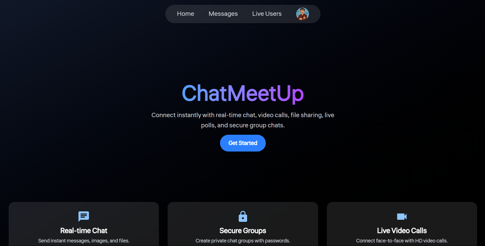
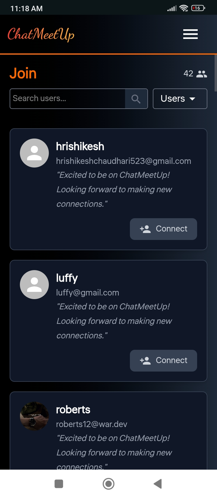
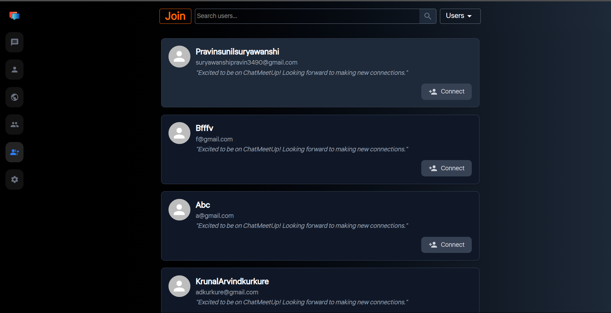
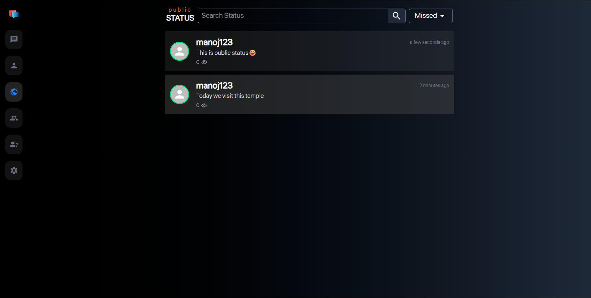
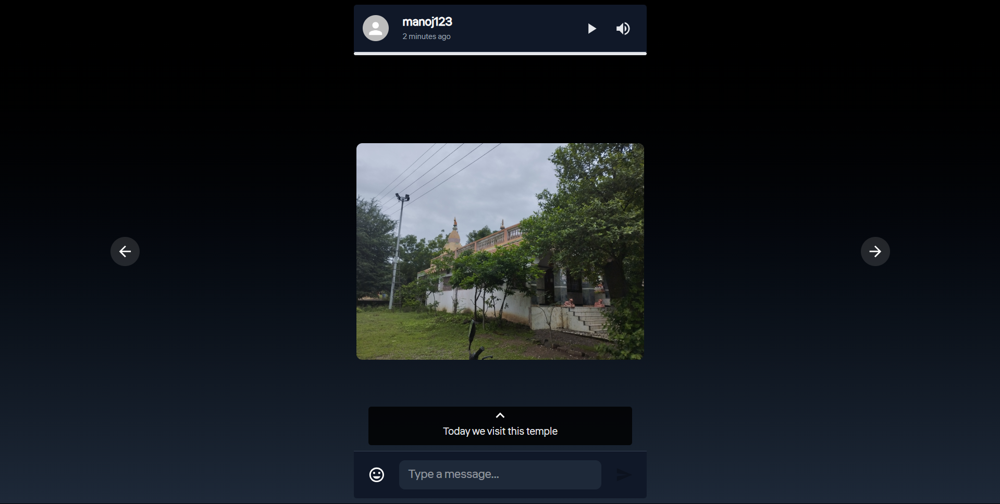
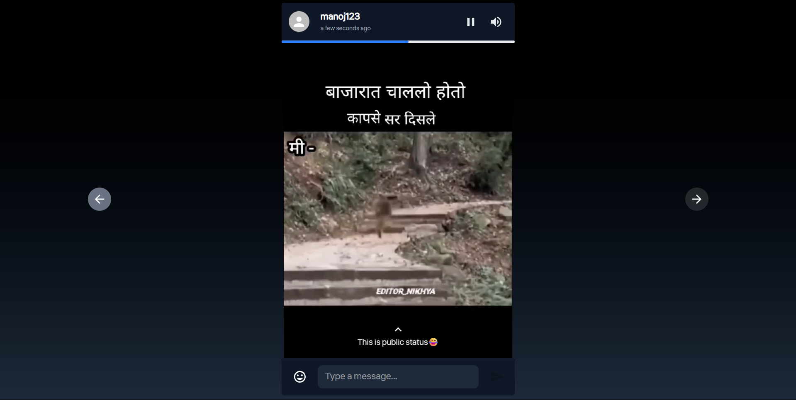
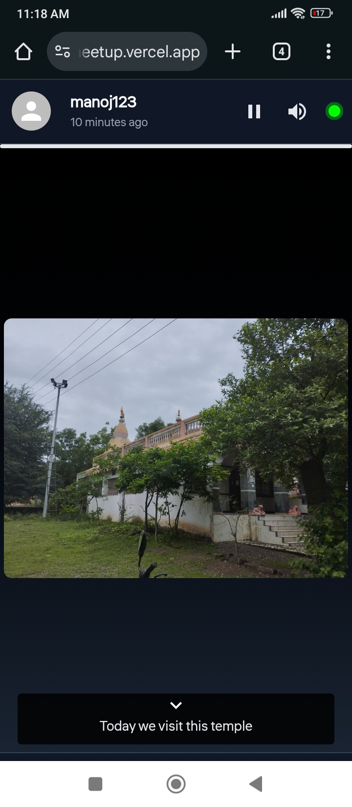
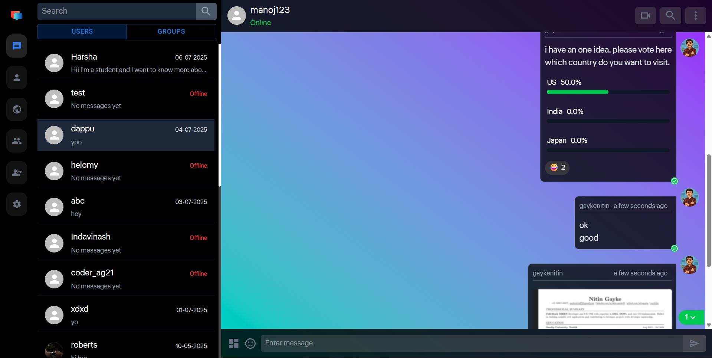
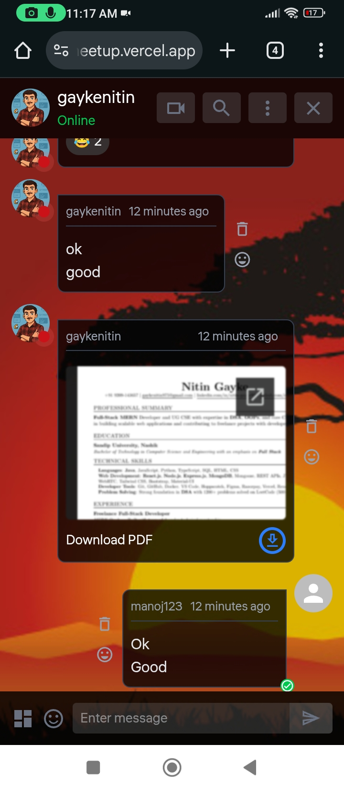

# ChatMeetUp – Real-Time MERN Stack Based Chat & Video Calling App



## 📌 About the Project

**ChatMeetUp** is a feature-rich, real-time chat and video calling platform developed using the **MERN Stack** (MongoDB, Express.js, React.js, Node.js). It supports:

* One-to-one and group messaging
* File and image sharing
* Status updates (private/public)
* Real-time notifications
* Poll creation and responses
* Video calls using WebRTC
* Profile updates
* User blocking/unblocking
* Secure authentication (JWT & Google OAuth)

> ✨ The platform simulates a WhatsApp-style chat experience with modern UI, real-time features, and a highly modular backend.

---

## ⚖️ Tech Stack

### 🖥️ Frontend (React + Vite)

* React.js, Vite
* Tailwind CSS, Material UI
* Framer Motion (UI animations)
* Emoji Picker
* React Router DOM
* Moment.js (timestamps)
* Notistack (Toasts)
* Axios

### ⚙️ Backend (Node.js + Express)

* Express + Node.js
* MongoDB + Mongoose
* JWT & bcryptjs Auth
* Socket.IO (real-time messaging)
* WebRTC (peer-to-peer video calls)
* Cloudinary (image uploads)
* Multer (file handling)

---

## 🏢 Hosted Links

* ✨ **Frontend**: [https://chatmeetup.vercel.app](https://chatmeetup.vercel.app/)
* 🌐 **Backend**: [https://chatmeetup-api.onrender.com](https://chatmeetupserver.onrender.com/)

**Demo Credentials:**

* ✉️ Email: `gaykenitin975@gmail.com`
* 🔑 Password: `nitin@123`

---

## 📅 Features & Screenshots

### 👥 User Joining & Group Creation

* Create or join group chats with name and image.

| Join User Mobile                             | Join User Laptop                               |
| -------------------------------------------- | ---------------------------------------------- |
|  |  |

---

### ✏️ Public & Private Status

*Share public/private status updates (text/image/video).*

| Total Status                    | Image Status View               | Video Status View               | Status In Mobile               |
| ------------------------------- | ------------------------------- | ------------------------------- | ------------------------------- |
|  |  |  |  |

---

### 💬 Chat Rooms (One-to-One & Group)

* Send text, emoji, media, and polls.
* Search chat history and users.

| Chat Room Laptop                 | Chat Room In Mobile              |
| ----------------------------- ---| ----------------------------- ---|
|  |  |

---

### 📹 Video Calls (1-to-1)

* Seamless peer-to-peer video calling using WebRTC.
* Auto reconnect and call decline options.

| Call Init                             | Call Live                             | Call UI                             |
| ------------------------------------- | ------------------------------------- | ----------------------------------- |
|  |  |  |

---

### 👤 User Profile & Settings

* Profile picture, status, update username/password.

| Profile View                      | Edit Profile                   |
| --------------------------------- | ------------------------------ |
|  |  |

---

## ⚙️ Installation Guide (Local Setup)

### 1. Clone the Repository

```bash
git clone https://github.com/nitingayke/ChatMeetUp.git
```

### 2. Setup Client (Frontend)

```bash
cd ChatMeetUp/client
npm install
npm run dev
```

### 3. Setup Server (Backend)

Open a new terminal:

```bash
cd ../server
npm install
nodemon
```

### 4. Environment Variables

#### Backend `.env`

```env
MONGO_URL=<your_mongodb_uri>
JWT_SECRET=<your_jwt_secret>
CLOUDINARY_CLOUD_NAME=<your_cloud_name>
CLOUDINARY_API_KEY=<your_api_key>
CLOUDINARY_API_SECRET=<your_api_secret>
```

---

## 📲 Mobile Responsive

* Entire app is fully responsive for mobile and tablet.


---

## 🔗 Connect With Me

Want to collaborate or have questions?

* 👨‍💼 [LinkedIn](https://www.linkedin.com/in/nitin-gayke92/)
* 🌐 [Portfolio](https://nitin-portfolio-gilt.vercel.app/)
* 📧 [Email](mailto:gaykenitin975@gmail.com)

---

> Proudly crafted with MERN Stack, real-time web technologies, and clean UI principles.
> 🌟 Inspired by WhatsApp, built for production!
